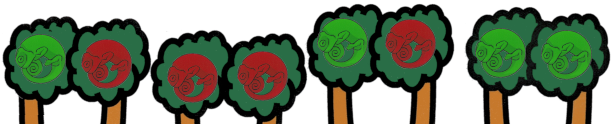
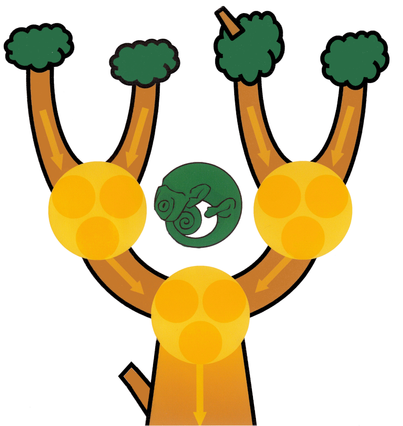
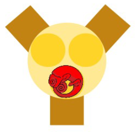
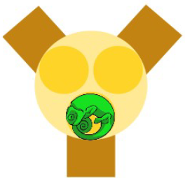
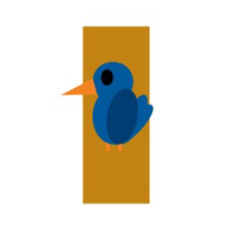
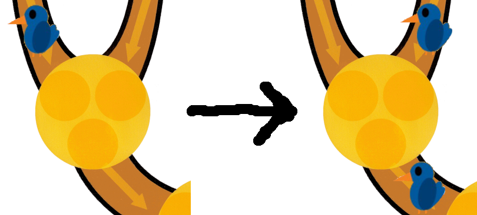

# Cameleons

## Règles

### Comment jouer

Au début du jeu, il faut placer les caméléons sur les branches en haut de l'arbre.

Ensuite, les caméléons descendent de l'arbre et vont dans les nids en dessous d'eux.

Quand c'est fait, les caméléons prennent la couleur de la majorité et le caméléon en bas du nid descend à l'étage en dessous. Quand le dernier caméléon arrive en bas, le jeu est fini.

### But du jeu

Le but du jeu est de faire en sorte que le caméléon dans le nid en bas de l'arbre soit vert quand il arrive en bas.

### Variante avec les oiseaux

Le jeu peut être joué avec des oiseaux. Les oiseaux se posent sur les branches et les caméléons qui rencontrent un oiseau en descendant les branches inversent leur couleur.

### Relation entre les portes logiques et les nids de caméléons

Dans le jeu, les nids de caméléons et les oiseaux peuvent être vus comme des portes logiques. Si on voit les caméléons vert comme $1$ et les caméléons rouges comme $0$, les caméléons d'en haut sont les entrées et le caméléon en bas est la sortie.

| Porte AND | Porte OR | Porte NOT |
| :-------: | :------: | :-------: |
|  |  |  |
| Pour que le caméléon en bas soit vert, il faut que les deux caméléons en haut soient verts. | Pour que le caméléon en bas soit vert, il faut que l'un des deux caméléons en haut soit vert. | Pour que le caméléon en bas soit vert, il faut que le caméléon en haut soit rouge. |

### Méthodes de résolutions

#### Méthode 1: Mettre tous les caméléons à vert

Quand il n'y a pas d'oiseaux, il suffit de mettre tous les caméléons en haut de l'arbre à vert pour que le caméléon en bas soit vert. Ça ne fonctionne que s'il n'y a pas d'oiseaux.

#### Méthode 2: Partir d'en bas

Cette méthode consiste a remonter dans l'arbre depuis le caméléon en bas pour déterminer les couleurs des caméléons en haut. Le problème ce cette méthode c'est que quand on a des grands arbres, il faut garder trop de choses en mémoire.

#### Méthode 3: Tourbillon de DeMorgan

Un sorcier nommé DeMorgan peur lancer des tourbillons qui font changer les oiseaux de branches. Si on lance un tourbillon sur un nid de caméléons, les branches qui ont des oiseaux deviennent des branches sans oiseaux et les branches sans oiseaux deviennent des branches avec des oiseaux.

Le principe de résolution consiste à lancer des tourbillons de DeMorgan pour faire remonter les oiseaux dans les branches les plus hautes de l'arbre. On peut alors utiliser la méthode 1 pour résoudre le problème a ceci près qu'on met un caméléon rouge s'il y a un oiseau sur la branche.

## Versions interactives

### Site HTML

Il existe une version intéractive disponible ici: [https://github.com/Robotechnic/cameleons](https://github.com/Robotechnic/cameleons) qui permet de faire une démonstration et de jouer en ligne.

### Tableau noir

Il y a aussi un fichier tableau noir dans le dossier materiel [cameleons.tableaunoir](materiel/cameleons.tableaunoir) qui permet de manipuler les pions de jeu de manière libre sur [tableau noir](https://tableaunoir.irisa.fr/).